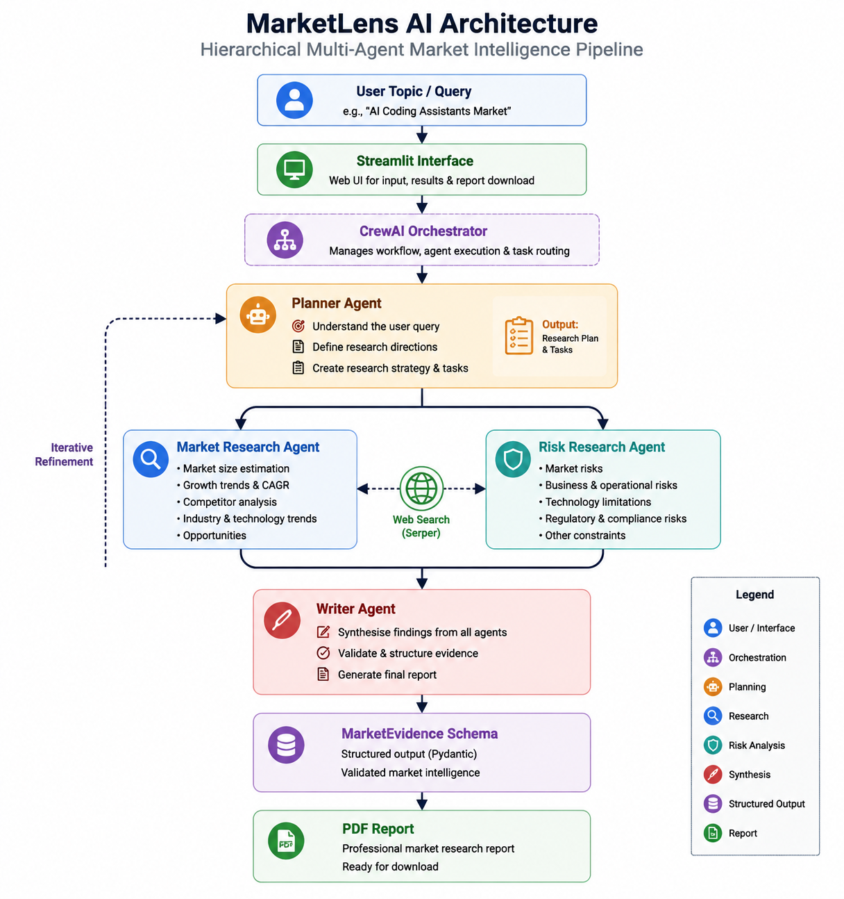
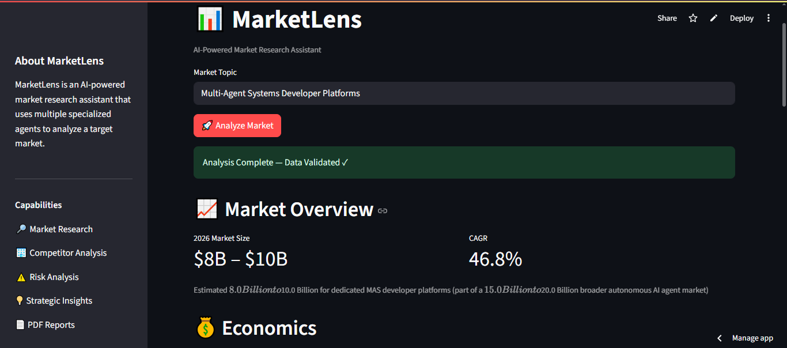
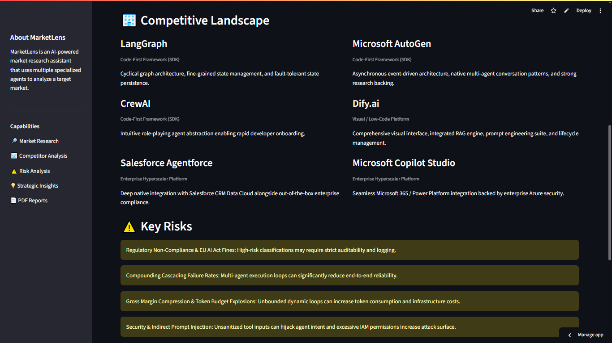
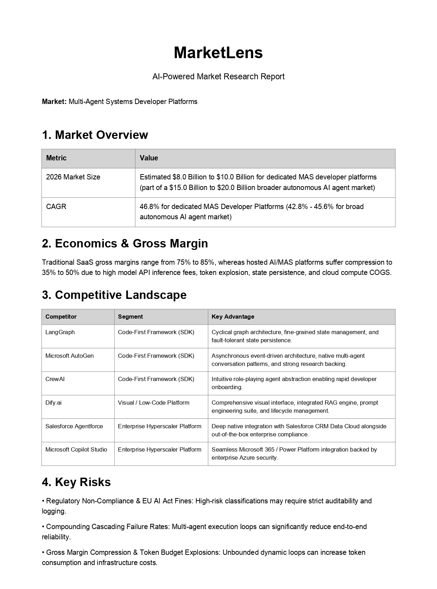

# MarketLens AI

An AI-powered market intelligence platform built with a hierarchical multi-agent architecture.

MarketLens uses specialized AI agents to analyze markets, identify competitors, evaluate risks, and generate structured research reports.

[🚀 Live Demo](https://marketlenslab.streamlit.app/)

---

## Overview

Market research often requires significant time and effort to collect information, analyze competitors, identify risks, and summarize findings.

MarketLens automates this process by combining:

- Large Language Models (LLMs)
- Hierarchical multi-agent orchestration
- Web-based research
- Structured data validation
- Automated report generation

The result is a market intelligence workflow that transforms a simple market topic into an evidence-based analysis report.

---

## Architecture

MarketLens uses a hierarchical multi-agent workflow where the Planner Agent operates at a higher level to define the research strategy, while specialized research agents execute focused analysis tasks.

The Writer Agent then synthesizes all findings into a structured and validated market intelligence report.

### Workflow

### 1. Planner Agent

The Planner Agent acts as the coordinator of the workflow.

Responsibilities:

- Understand the research objective
- Define analysis directions
- Create research strategy
- Guide downstream research agents

---

### 2. Specialized Research Agents

The Planner Agent's output is used by two specialized research agents:

#### Market Research Agent

Focuses on market intelligence:

- Market size estimation
- Growth trends
- CAGR analysis
- Competitor landscape
- Industry opportunities

#### Risk Research Agent

Analyzes potential challenges:

- Market risks
- Business constraints
- Technology limitations
- Regulatory considerations

---

### 3. Writer Agent

The Writer Agent synthesizes all collected evidence into a structured report.

Responsibilities:

- Combine research findings
- Generate strategic insights
- Produce validated MarketEvidence output
- Prepare final report

---

## Key Features

✅ Hierarchical multi-agent architecture  
✅ Autonomous market research workflow  
✅ Web-based information gathering  
✅ Competitor analysis  
✅ Risk assessment  
✅ Structured output validation with Pydantic  
✅ Automated PDF report generation  
✅ Streamlit-based user interface  

---

## Technology Stack

- Python
- CrewAI
- Gemini LLM
- Serper Search API
- Pydantic
- Streamlit

---

## Demo

### MarketLens Dashboard

---

### Market Analysis

---

### Generated PDF Report

---

## Example Analysis

### Input

Multi-Agent Systems Developer Platforms

### Generated Report Includes

- Market overview
- Market size and CAGR
- Economics and gross margin considerations
- Competitive landscape
- Key risks
- Strategic insights

---

## Project Structure

This repository contains the public-facing portfolio materials for MarketLens.

Project structure:

    marketlens-ai/
    |
    ├── README.md
    ├── LICENSE
    |
    ├── assets/
    |   └── architecture.png
    |
    └── screenshots/
        ├── dashboard.png
        ├── analysis.png
        └── pdf_report.png

The full application source code is maintained separately.

---

## Installation

The public repository currently focuses on project documentation, architecture, and demonstration materials.

The live application is available through Streamlit Community Cloud.

---

## Future Improvements

Potential future enhancements include:

- Retrieval-Augmented Generation (RAG) for historical reports
- Persistent analysis memory
- Additional specialized research agents
- More market data sources
- Advanced market forecasting

---

## Author

Built as a practical AI engineering portfolio project demonstrating:

- Multi-agent systems
- LLM application development
- AI-assisted research workflows
- Structured data validation
- Automated report generation
