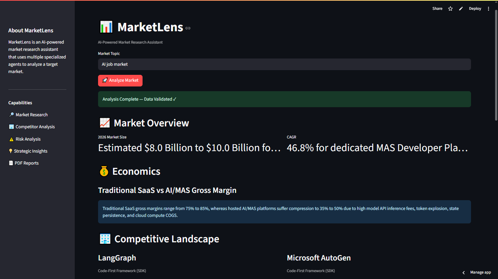
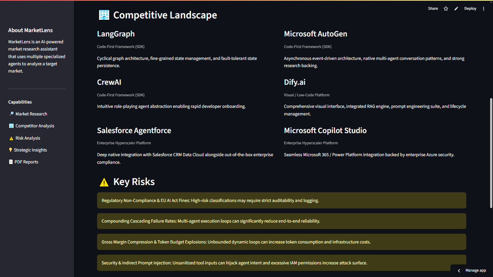

# MarketLens Demo: AI Job Market Analysis

## Overview

This demo shows how MarketLens can be used to analyze a complex market using AI-powered research agents.

The idea behind this analysis started with a simple question:

> How is the AI job market evolving, and what skills are becoming increasingly valuable?

The AI job market is changing rapidly, with new roles, tools, and required skills emerging continuously. Understanding this market requires analyzing multiple dimensions instead of looking at a single data point.

MarketLens explores how AI agents can help structure this type of market research.

---

## Research Objective

Analyze the current AI job market landscape and identify:

- Emerging AI-related roles
- In-demand technical skills
- Market trends
- Key opportunities and challenges
- Strategic insights for people entering or evolving in the AI field

---

## How MarketLens Approaches the Analysis

Instead of relying on a single AI response, MarketLens divides the research process into specialized tasks.

The system analyzes different aspects of the market and combines the findings into a structured report.

High-level workflow:

```
Market Question
       |
       ↓
Specialized AI Research Agents
       |
       ↓
Structured Market Evidence
       |
       ↓
Final Analysis Report
```

---

## Generated Outputs

This demo includes:

### 📄 Market Report

A human-readable PDF report containing:

- Market overview
- Role analysis
- Skill landscape
- Trends
- Risks
- Key takeaways

### 📊 Structured Output

A JSON representation of the analysis results.

This structured format allows the findings to be validated, processed, and reused by other applications.

---

## Demo Screenshots

### Dashboard




### Analysis Results



---

## Files

```
ai_job_market/
│
├── README.md
├── ai_job_market_analysis.pdf
├── ai_job_market_output.json
│
└── screenshots/
    ├── dashboard.png
    └── analysis.png
```

---

## Key Takeaway

This demo represents an early exploration of how multi-agent AI systems can support market intelligence workflows.

The goal of MarketLens is not only to collect information, but to organize research, combine different perspectives, and generate structured insights for better decision-making.

For a detailed explanation of the problem, approach, and lessons learned, see the [Case Study](case_study.md).
